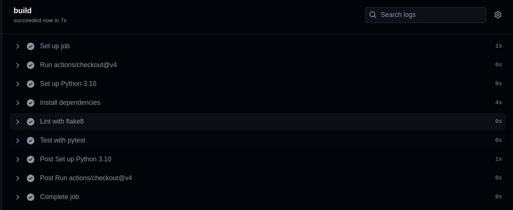

We have learned how to write tests for our Python code. Now, we will learn how to automate the testing process using GitHub Actions.

To read more about GitHub Actions, visit the [official documentation](https://docs.github.com/en/actions).

## Setting up GitHub Actions for Python

To set up GitHub Actions for Python, we need to create a new file in the `.github/workflows/` directory of our repository. This file will contain the configuration for the GitHub Actions workflow. If this directory does not exist, create it.

### Basics

GitHub Actions workflows are defined in YAML files with a `.yml` extension.
Here is an example of a simple GitHub Actions workflow configuration executing a simple `echo` command:

```yaml title=.github/workflows/simple-example.yml
# python github action example
name: Simple GitHub Action Example
run-name: ${{ github.actor }} is testing out GitHub Actions 🚀
on: [push]
jobs:
  Explore-GitHub-Actions:
    runs-on: ubuntu-latest
    steps:
      - run: echo "🎉 The job was automatically triggered by a ${{ github.event_name }} event."
```

As configured, this workflow will run on **every push event** to the repository. The job will run on an `ubuntu-latest` runner and execute a **single step** that **echoes a message**.

### Python Actions

In GitHub Actions, we can either use pre-defined actions or create custom actions with custom script execution, as before with the `echo` command.
As mentioned, GitHub also provides a set of pre-defined actions that can be used in workflows and act as starting point.

We configure this workflow to trigger on `pushes to main` or in `pull requests to main`. The workflow will run on an `ubuntu-latest` runner and execute the following steps:

First, we can use the `actions/checkout` action to check out the repository code.
For Python specifically, we can use the `actions/setup-python` action to set up the Python environment, i.e. install Python with a specific version.

Next up, we want to install the dependencies of our Python project. This can be done manually as step by running `pip install` commands. In the below configuration, we install `flake8` and `pytest` as well as any dependencies listed in a `requirements.txt` file if present.

Finally, we can run steps to lint and test our code with `flake8` and `pytest` respectively.

```yaml title=.github/workflows/python.yml
# This workflow will install Python dependencies, run tests and lint with a single version of Python
# For more information see: https://docs.github.com/en/actions/automating-builds-and-tests/building-and-testing-python

name: Python application

on:
  push:
    branches: [ "main" ]
  pull_request:
    branches: [ "main" ]

permissions:
  contents: read

jobs:
  build:

    runs-on: ubuntu-latest

    steps:
    - uses: actions/checkout@v4
    - name: Set up Python 3.10
      uses: actions/setup-python@v3
      with:
        python-version: "3.12"
    - name: Install dependencies
      run: |
        python -m pip install --upgrade pip
        pip install flake8 pytest
        if [ -f requirements.txt ]; then pip install -r requirements.txt; fi
    - name: Lint with flake8
      run: |
        # stop the build if there are Python syntax errors or undefined names
        flake8 . --count --select=E9,F63,F7,F82 --show-source --statistics
        # exit-zero treats all errors as warnings. The GitHub editor is 127 chars wide
        flake8 . --count --exit-zero --max-complexity=10 --max-line-length=127 --statistics
    - name: Test with pytest
      run: |
        pytest
```

You can create this configuration yourself in your repository, but can also click your ways thorugh the GitHub UI wihtin your repository to create this workflow file via the `Actions` tab and the `Python application` template.

If you now commit changes to the repository, you will see this GitHub Actions workflow being triggered and executed. You can view the logs and results of the workflow run in the `Actions` tab of your repository. See this example image: .