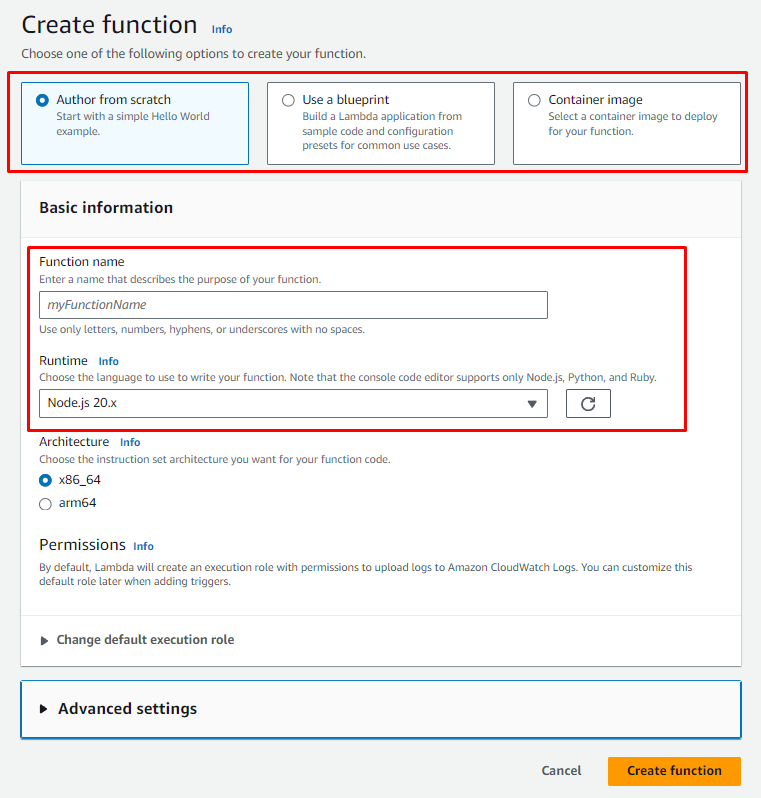
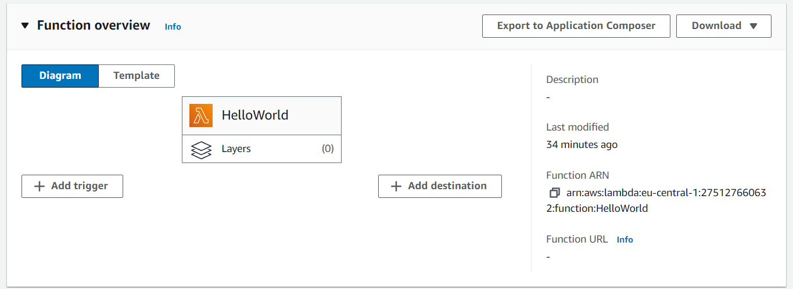
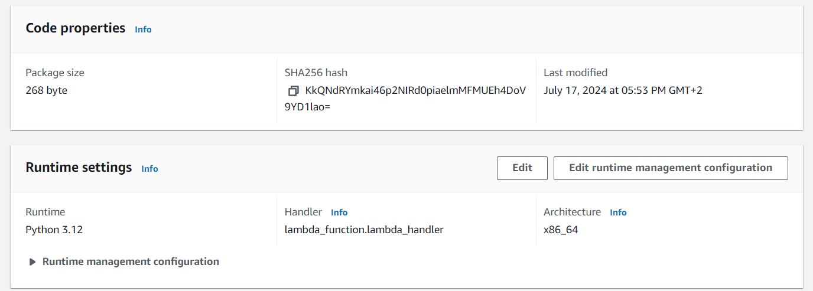

A goto starting point of any cloud journey is to understand the concept of serverless functions. 
In this tutorial, we will be diving into the realm of serverless functions with AWS Lambda.
We will mainly be covering on the topic of "how to get my code running in the cloud".


## Basics
### The AWS Management Console

The AWS Management Console is a web-based interface. Its the starting point of where you can create, configure, and manage your AWS services and resources.

It can be accessed via [https://aws.amazon.com/console/](https://aws.amazon.com/console/) and may seem daunting at first, but it is a powerful tool.

### What is AWS Lambda?

AWS Lambda is a serverless compute service that lets you run code without provisioning or managing servers.
In short: You deploy your packaged code, and AWS Lambda runs it for you.

## Getting Started

The main goal is to have a simple "Hello World" running in the cloud.

We will be creating our resources via the Management Console and will be using the Python programming language.
For more sophisticated use managing functions, you can use the AWS CLI, SDKs or IaC tools like Terraform.

First, we need to create a Lambda function:
1. In the AWS Management Console, we can search for "Lambda" and navigate to its service page
2. To create a function, we can click on "Create function"
3. We are presented with a few options to create a function as seen in the image below
   1. The first red box is where we can select the way of creating a function, either from scratch or using a blueprint or with a container image (e.g. docker)
   2. The second red box is where we can configure the function, for now important: the name of the function, and what kind of runtime
4. We can give our function a name, for example, "HelloWorld"
5. As runtime, we will be choosing "Python 3.12"
6. Options for "Architecture" and "Permissions" as well as "Adbanced Settings" can be ignored and left as default for now
7. With that, we can click on "Create function" to create our function


## What do we see here?

We have created a Lambda function with the name "HelloWorld" and the runtime "Python 3.12".
If we click on the function, we are presented with the function's details, configuration, and a bunch of other options.

### The function overview


In this overview, we can see the a illustration of the functions alongside with its "triggers" and "destintations".
For the most part, "tirggers" are of interest to us, as they are the entry point of our function.
With which we can trigger our function for example with an API Gateway or S3 bucket, but mor of that later.

### Information tabs

The function overview also shows us different tabs for different information and configuration topics.

- *Code*: Here we can see the code of our function, which should pre-filled with a "Hello World" example editable with the inline-editor
- *Test*: Where we can test our function with different input, though cautions, as this implies internal magic
- *Monitor*: Where we can see logs and metrics of our function
- *Configuration*: Where we can configure more details of our function, for example:
   - environment variables, permissions, networking, etc.
- *Aliases*: Where we can manage different aliases of our function that can be referenced
- *Versions*: Where different versions of our function can be managed

### The code tab

In the "Code" tab, we can see the aforementioned inline-editor.
Code can be written directly from the browser, tested and deployed via corresponding buttons.
⚠️ Usually, this editor is only visible for very small functions, for larger or more complex functions, code is uploaded via a zip file or S3 bucket.

The inline-editor should have following code pre-filled:
```python
import json

def lambda_handler(event, context):
    # TODO implement
    return {
        'statusCode': 200,
        'body': json.dumps('Hello from Lambda!')
    }
```

This code is a simple Lambda function that returns a JSON object with a status code of 200 and a body of "Hello from Lambda!".
It is the basic structure of a Lambda function: a function with two arguments, `event` and `context`, doing some work and returning a response.

Scrolling down, we see the following information:


As of interest is the configured "Runtime", i.e. "Python 3.12", and the "Handler", i.e. `lambda_function.lambda_handler`. 
Where the latter acts as the entry point of the function, i.e. the specific location of our implemented function.

It is configured for python as `filename.function_name`, where `filename` is the name of the file and `function_name` is the name of the function.
In our case, the file is `lambda_function` and the function is `lambda_handler`.


### The test tab

In the "Test" tab, we can test our function with different input.
If you changed the code in the "Code" tab, you will have to make sure that it is deployed before testing it.

The test tab should have a pre-filled test event, which is a JSON object with an empty dictionary `{}`.
In the case of our function, the input is not used, so we can leave it as is - or you may change the function to use the input ;).

When clicking on "Test", the function is executed with the input and the output can be seen.
If any problems occur, the error message will be displayed as well.
